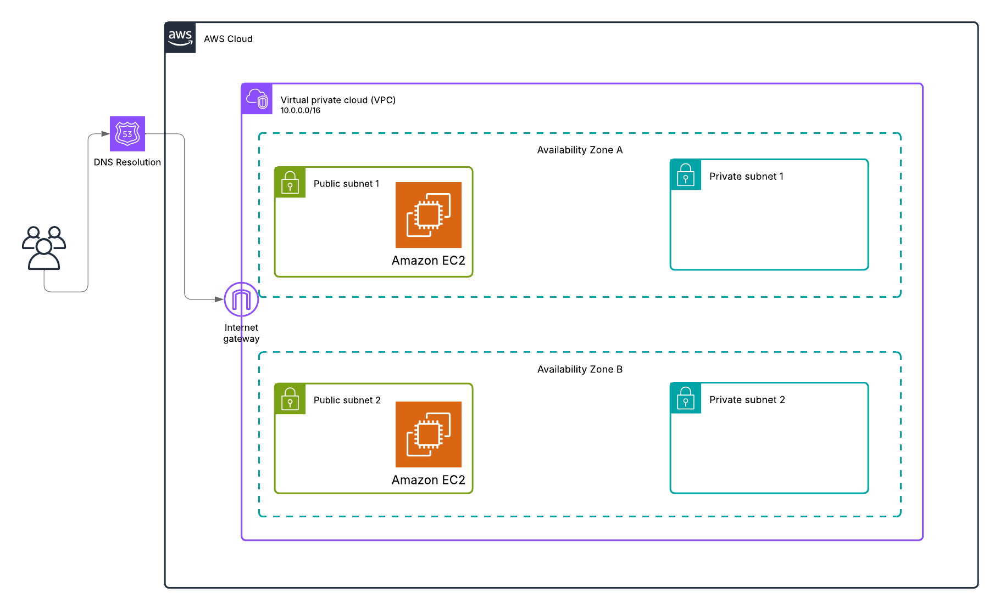

# Terraform VPC with EC2 and Apache (Non-Modular Setup)

This project creates a basic AWS VPC infrastructure using Terraform. It includes:

- A VPC
- Two public and two private subnets (in different AZs)
- An Internet Gateway
- Route table for the subnets
- Security groups
- A t2.micro EC2 instance with Apache preinstalled (via user-data script)
- Remote backend using an s3 bucket with the latest locking feauture.

---

## 📁 Project Architecture



## Project Structure
```bash
│   .gitignore
│   README.md
│
├───backend
│   │   .terraform.lock.hcl
│   │   backend.plan
│   │   main.tf
│   │   outputs.tf
│   │   providers.tf
│   │   terraform.tfstate
│   │   variables.tf
│
└───infra
    │   .terraform.lock.hcl
    │   infra.plan
    │   main.tf
    │   outputs.tf
    │   providers.tf
    │   variables.tf

```

## Commands to Deploy
1. Clone the repo
```bash
git clone https://github.com/your-username/terraform-vpc-project.git
cd terraform-vpc-project
```

## Quick and fast way:
The quickest way to do this will be to use the `makefile` as follows:
- To get possible commands
```bash
make help
```
- Run backend infra first
```bash
make deploy/backend
```
- Then deploy the infra:
```bash
make deploy/infra
```

**If you want a more engaging way, do the following:**
2. Configure the Remote Backend

Go into the backend folder to initialize and apply the backend configuration (S3 + DynamoDB):
```bash
cd backend
terraform init
terraform plan
terraform apply
```
_✅ This creates the required remote backend infrastructure for storing Terraform state safely in S3 without the usage or locking via DynamoDB._

3. Deploy the VPC and EC2 Infrastructure

Return to the main project folder (or infra/ if structured that way):
```bash
cd ../infra
```
Then initialize Terraform using the now-configured remote backend:
```bash
terraform init
```

Preview the execution plan:
```bash
terraform plan -out="infra.plan"
```
_You can also perform the plan without piping the output_

Apply the configuration:
```bash
terraform apply "infra.plan"
```
_You can also just run without referencing the plan file with auto-approve like so: `terraform apply -auto-approve`_

## Destroying
Don't forget to destroy the resources when you are done:
```bash
terraform destroy
```