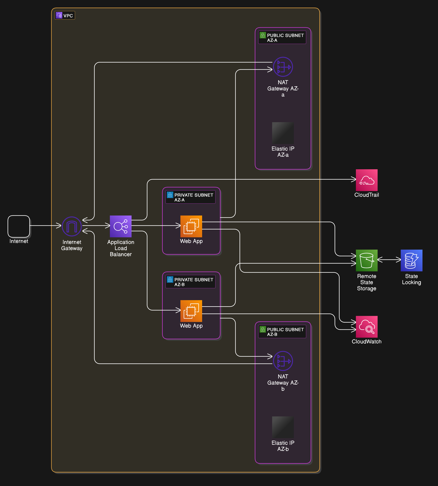

# A Terraform AWS Infrastructure Sample Project



## Table of Contents

- [About](#about)
- [Getting Started](#getting_started)
- [Cleanup](#cleanup)
- [Best Practices](#best_practices)

## About <a name = "about"></a>
This repository contains two distinct implementations of AWS infrastructure using Terraform:
1. **Non-modularized** - A straightforward, all-in-one configuration
2. **Modularized** - A reusable, environment-aware architecture


## � Implementation Comparison

| Feature              | Non-Modularized          | Modularized               |
|----------------------|--------------------------|---------------------------|
| Structure            | Flat hierarchy           | Environment separation    |
| Reusability          | Limited                  | High (via modules)        |
| Deployment Target    | Single environment       | Multi-environment         |
| Complexity           | Beginner-friendly        | Intermediate/Advanced     |
| Best For             | Quick proofs-of-concept  | Production-grade setups   |


### Prerequisites
- Terraform v1.11.0+
- AWS CLI configured
- Make (optional but recommended)

### Quick Deployment

#### Non-Modularized Approach
```bash
cd non-modularized
make deploy/backend  # Set up remote backend
make deploy/infra    # Deploy main infrastructure

## Modularized Approach
```bash
cd modularized
make deploy/backend  # Set up remote backend
make deploy/modularized ENV=development  # Deploy to dev environment
```

## 🚀 Getting Started <a name="getting_started">
1. Non-Modularized Implementation
    - Simple VPC with EC2 instance
    - Basic remote backend setup
    - Single environment deployment

2. Modularized Implementation
    - Environment-aware architecture
    - Reusable network/compute modules
    - Isolated state per environment
    - **Added ALB and NAT gateway including scalability.**

## 🛠 Makefile Support

Both implementations include Makefiles for simplified operations:
```bash
# Show available commands
make help

# Common commands (run from each implementation's directory)
make deploy/backend     # Initialize remote backend
make deploy/infra       # Non-modularized deploy
make deploy/modularized ENV=<env>  # Modularized deploy
make destroy/<target>   # Destroy infrastructure
```

## 🛑 Cleanup <a name="cleanup">
Always destroy resources when finished:
```bash
# Non-modularized
make destroy/infra
make destroy/backend

# Modularized
make destroy/modularized ENV=development
make destroy/backend
```

## 💡 Best Practices <a name="best_practices">

1. Use terraform fmt to maintain consistent formatting
2. Regularly run terraform validate
3. Version pin all providers and modules
4. Document all input variables and outputs
5. Review plans before applying changes

## 🆘 Troubleshooting

- Common Issues:

    - Authentication Errors: Verify AWS credentials

    - ~~State Locking: Check DynamoDB tables if operations hang~~ 
 
    - Provider Issues: Run terraform init -upgrade